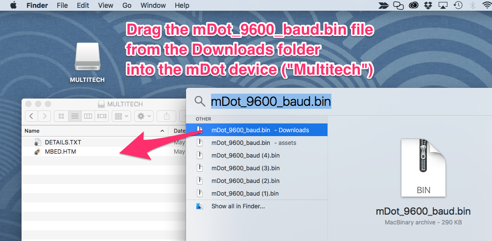
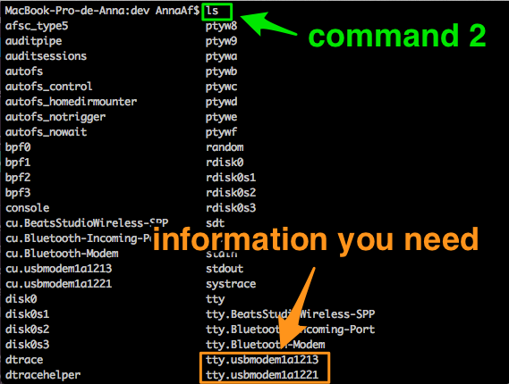
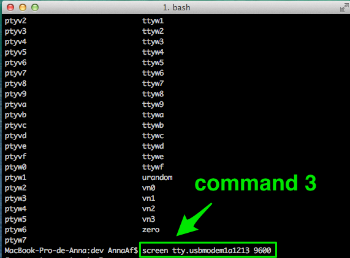
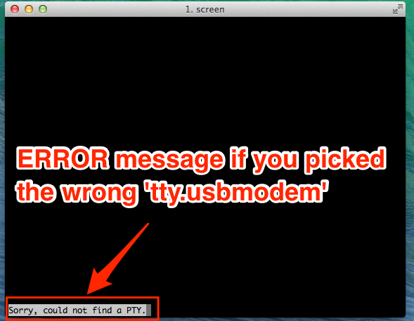
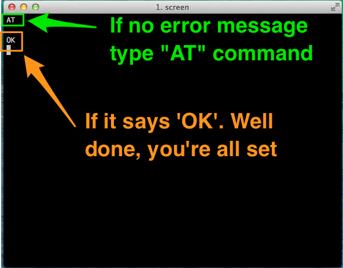
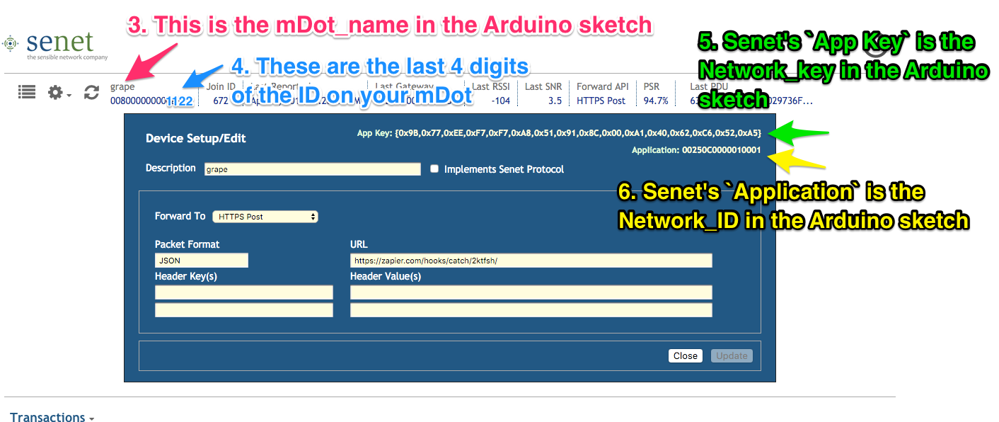

# 4. Configure the software

## mDot 
[  ](assets/mDot_9600_baud.bin?raw=true)  

By default, the Multitech mDot is configured to communicate with AT commands at a 115200 baud rate. However, we found that errors happened between the mDot and the Arduino when they tried to communitacte that fast, so [here's firmware](assets/mDot_9600_baud.bin?raw=true) (a .bin file) with a slower 9600 baud rate, which works much better.  

On a MacBook it's simple to load the firmware:   

* Drag & drop the .bin file into the mDot's disk image. After the firmware loads, you'll get an error message **`Disk Not Ejected Properly`** -- don't worry, that's normal. Now you'll want to validate that the firmware loaded correctly.  
* Unplug and replug the USB dev board from your laptop to be safe (keep the mDot attached to the dev board). 
* Open a terminal window (we use [iTerm2](https://www.iterm2.com/)). 
*  `cd /dev` to navigate to the folder with the dev board.
*  `ls` to list all of the contents of the folder. Look for a something that looks like *`tty.usbmodem1234`*. If you have more than one of these, you'll need to trial-and-error to determine which one is the dev board. 
*  _`screen tty.usbmodem1234 9600`_ to begin communicating with your board with the `screen` command. Again, you'll need to customize `tty.usbmodem1234` to have the numbers of your particular board.  The `9600` indicates that you're using a 9600 baud rate. 
*  A new screen will open, indicating that you're communicating with the board. Now type `"AT"` to confirm that the board uses AT commands.  
*  The board should respond with `OK`.  If it does, then firmware should be loaded correctly and you're all set -- just eject the board and continue with the project.  If the board doesn't reply with `OK` then you'll need to retry installing the mDot firware.  
 
_(We haven't done this on a Windows PC. If Windows is different, please let us know how you loaded the mDot firmware and we'll update the instructions here.)_ 
 
  

  

  

  

  
  
  
  
  
  
  
  
  
## Register the mDot with Senet and get identifiers
You'll need to register the mDot with Senet to get identifiers for the Arduino sketch.  First, go to the [Senet portal](https://portal.senetco.com/) and register your device by providing the device ID and nickname (similar to what you did with the NorAm mote). Next, click on the mDot name to open a webpage with the mDot's information and then follow these steps: 

1. Click on the gear to open the menu.
2. Click on `Device Edit` to reveal the `Device Setup/Edit` sub-menu.
3. Take note of `mDot_name`, the nickname you gave the mDot
4. Take note of `XXXX`, the last 4 digits of the ID number on the mDot
5. Take note of the Senet `App Key`, which is referred to as the `Network_key` in the Arduino sketch.
6. Take note of the Senet `Application` number, which is referred to as the `Network_ID` in the Arduino sketch. 

  
   





## Arduino sketch
[](assets/LoRa_Arduino_quickstart_April2016.ino?raw=true)  

**You must customize your Arduino code so that it works with your mDot**.  You'll need the [Arduino IDE](https://www.arduino.cc/en/Main/Software) to configure [the LoRa-Arduino sketch](assets/LoRa_Arduino_quickstart_April2016.ino?raw=true).  The code starting at Line 27 is a template for you to modify: 

```Arduino
// *** Select the current mDot **
// Update the mDot data below to reflect the name, network key, and network identifier your mDot(s) 
// You need to adjust the comments in the code to select the mDot you're currently using
/* AAA with ID ending in 11:22 */     const String mDot_name = "AAA"; const String Network_key =  "11:22:33:44:55:11:22:33:44:55:11:22:33:44:11:22"; const String Network_ID = "11:22:33:44:55"; 
/* BBB with ID ending in 33:44 */    // const String mDot_name = "BBB"; const String Network_key = "11:22:33:44:55:11:22:33:44:55:11:22:33:44:33:44"; const String Network_ID = "11:22:33:44:55"; 
/* CCC with ID ending in 55:66 */    // const String mDot_name = "CCC"; const String Network_key = "11:22:33:44:55:11:22:33:44:55:11:22:33:44:55:66"; const String Network_ID = "11:22:33:44:55"; 
```

Replace `AAA` with your mDot nickname, `11:22` with the last 4 digits of your mDot ID number, as well as the `Network_key` and `Network_ID` with your unique values from Senet.  Note that Senet provides the ID in the format `0x11,0x22,0x33,...` which you'll need to change to `11:22:33:...`.

This template assumes that you have three mDots (you're ambitious!) named `AAA`, `BBB` and `CCC` with ID numbers ending in `11:22`, `33:44` and `55:66`, respectively.  If you've only got one mDot, then simply delete the lines for `BBB` and `CCC`. If you've got multiple mDots, then you can update `BBB` and `CCC` with your mDot information. When you run the sketch, you'll need to ensure that the code is commented with `//` so that only one mDot is selected at a time.  Be sure to save your customized file. 

*show cassis and how we labeled the mDot and tied the device # to the name*

We've commented the .ino file extensively so that you can understand how the code works.  In brief, in `setup()` the device sends AT commands to join the LoRa network and in `loop()` the device samples the sensors every 100ms and sends a LoRa data payload every 15 minutes.  The sketch gathers sensor data to demonstrate *LoRa* by monitoring activities:  

 1. `Click` Count how many times users click a button.  
 2. `Sound` Count how many times there's a loud noise.   
 3. `Light` Meausre the average light level.
  
## Next tutorial
5.[Assemble the hardware](5_AssembleHardware.md) 
