# LoRa-Arduino quickstart project


# Overview
###This project allows you to quickly try LoRa communications. 
**LoRa** is an exciting new technology for communicating at **Lo**ng **Ra**nge, low power, and low cost.  This project uses an Arduino Uno and a [Multitech mDot LoRa node](http://www.multitech.com/models/94557148LF) to send data to the [Senet LoRa network](https://app.senetco.com/senetdev/login.aspx).  Senet provides the gateways to receive the LoRa signal; [Zapier](https://zapier.com) and  Google Spreadsheets provide the rest of the software. 

It should take **about 1 hour to complete this project**, once you have the hardware. We've included lots of photos and screenshots to explain the project visually; the text provides additional details. 

This project was developed by the [Orange IoT Studio](http://orangeiotstudio.com/) to promote the adoption of LoRa. To that end, the IoT Studio is [supporting companies](http://orangeiotstudio.com/) interested in LoRa by donating hardware kits and by funding co-development.  


### LoRa is great for IoT
LoRa is an ideal communications technology for many internet-of-things (IoT) devices because **internet connectivity** is a key feature of IoT while also one of IoT devices' the biggest pain points.  Specifically, pairing devices with WiFi or Bluetooth is tedious; cellular connectivity is easy to implement and can transmit megabytes (MB) of data, but it's often not affordable for simple IoT devices. That's where LoRa comes in. For simple IoT devices that only need to send kilobytes (KB) of data or less, LoRa is an ideal solution.  

Public LoRa networks are being deployed world wide, including by [Orange in France](http://www.orange.com/en/Press-and-medias/press-releases-2016/press-releases-2015/Orange-deploys-a-network-for-the-Internet-of-Things). This project uses the [Senet LoRa network](https://app.senetco.com/senetdev/login.aspx) in North America since it was developed by the [Orange IoT Studio](http://orangeiotstudio.com/), part of [Orange Silicon Valley](http://orangesv.com/) in San Francisco. 

### Project overview  
1. Get the hardware 
2. Create your accounts
3. Verify LoRa coverage
4. Configure the software
5. Assemble the hardware 
6. Test drive LoRa
7. Build on LoRa & promote your vision

### Skills you need

* Basic programming experience
* Familiarity with Arduino
 
### _Disclaimer_
_LoRa is a new technology and this project is in alpha, so it could break. If you're cool trying new things that aren't 100% reliable, proceed and have fun._   


## Get the hardware
You'll need to either apply for a hardware kit from the IoT studio or purchase the equipment yourself. 

### Apply for support from the IoT Studio
The IoT Studio is [supporting the developer community](http://orangeiotstudio.com/) to encourage use of LoRa.  You can apply for a free hardware kit containing the bill of materials, below. If you work for a company with a compelling use case, you can also apply for funded co-development.  The IoT Studio will be showcasing prototypes that demonstrate compelling LoRa use cases.


### Bill of Materials (BOM)
You need the basic equipment for the project and a set of sensors, either by LittleBits or by Adafruit.  You'll need one (1) of each item below, unless otherwise noted. The prices are estimates.  _Note that the XBee shield is only used as a physical interface between the mDot and the Arduino. This project does not use XBee communications._

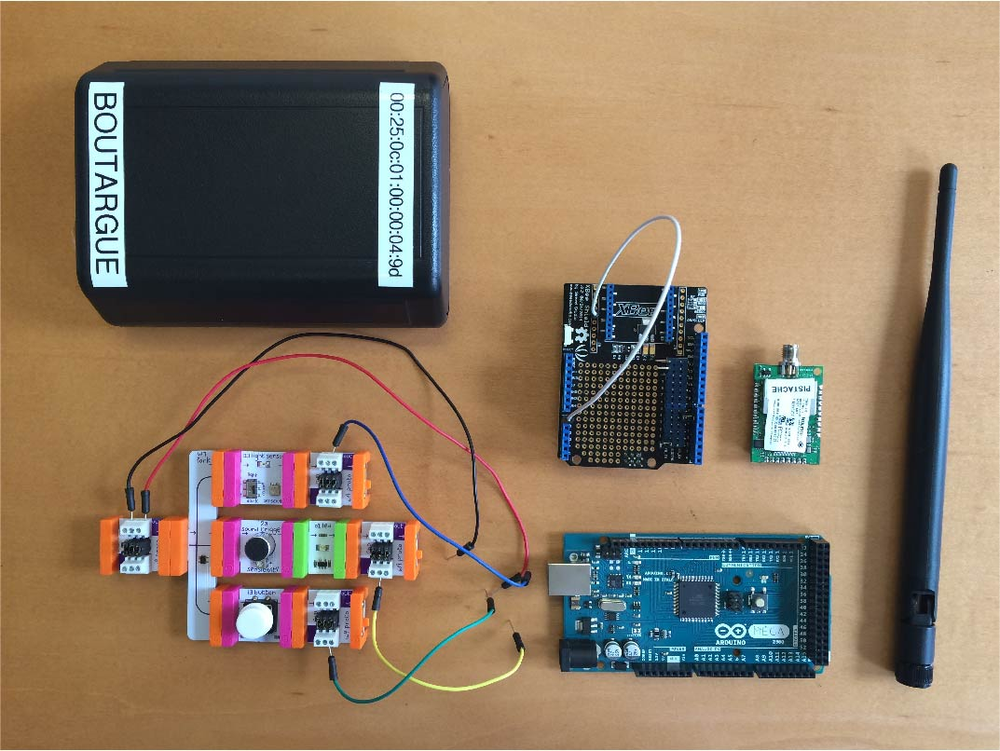

####Basic equipment  

* [Multitech mDot](http://www.digikey.com/product-search/en?mpart=MTDOT-915-X1P-SMA-1&v=591&v=881),  $60 
* [Arduino Uno](https://www.sparkfun.com/products/11021),  $25 
* [XBee shield v2.0](http://www.robotmesh.com/xbee-shield-v2-0),  $10 (There are a few versions so be sure to get the [Seeed Studio version](http://www.seeedstudio.com/wiki/XBee_Shield_V2.0))  
* [Antenna for mDot](http://www.digikey.com/product-detail/en/multi-tech-systems/AN868-915A-10HRA/881-1242-ND/5246371), $10
* [USB A-B cable](https://www.adafruit.com/products/62), $4
* [mDOT USB developer board](http://www.multitech.com/brands/micro-mdot-devkit), _??get link with price!_
* [Wires](https://www.adafruit.com/products/1956), $2 (you'll need 6 male-male wires)
* [Semtech NorAm mote LoRa network tester](http://www.semtech.com/images/datasheet/NorAmMote_User_Guide_3v0.2.pdf), _??get link with price!_	

####LittleBits sensors 
LittleBits sensors are easier to use, but more expensive.  If you prefer the something more affordable use the Adafruit sensors.

* [LittleBits Proto](https://littlebits.cc/bits/proto), $50 (you'll need 4 Protos at $12/piece)
* [LittleBits Fork](https://littlebits.cc/bits/fork), $12
* [LittleBits Sound trigger](http://littlebits.cc/bits/sound-trigger), $12
* [LittleBits Light sensor](http://littlebits.cc/bits/light-sensor), $12
* [LittleBits Button](http://littlebits.cc/bits/button), $8
* [LittleBits LED](http://littlebits.cc/bits/led), $8
 

#### Adafruit sensors 
Adafruit sensors require more work, but are more affordable. If you prefer something easier, use the LittleBits sensors.  
_Mike & Anna need to try this!!_

* [Breadboard](https://www.adafruit.com/products/64), $5
* [Sound trigger - Microphone Amplifier](https://www.adafruit.com/product/1063), $6.95 
* [Light sensor - Photo transistor](https://www.adafruit.com/products/2831), $0.95
* [Tactile Button switch ](https://www.adafruit.com/products/367), $2.5
* [LED](https://www.adafruit.com/products/299), $4

## Create your accounts
You'll need to create accounts with the following websites to get this project to work.  

### Senet
[Senet](https://app.senetco.com/senetdev/login.aspx) is continuing to expand their public LoRa network in the United States. You'll need to create an account with Senet to view and access your data.  

[  ](https://app.senetco.com/senetdev/login.aspx)  

### Zapier
[Zapier](https://zapier.com) automates the flow of data between Senet and Google Docs. For this project, we'll have Senet do an HTTP Post to a Zapier webhook. Zapier then puts the contents of Senet's JSON payload into a row in a Google Spreadsheet (gDocs). 

[  ](https://zapier.com/)

### Google Drive
You'll use [Google Spreadsheets](https://docs.google.com/spreadsheets/u/0/) to view and analyze your data in this project. Since you probably already have a Google Drive account, we highly recommend that you do all work on this project in new spreadsheets, as opposed to tabs in existing spreadsheets.  This safety measure will help ensure that if things go wrong, they don't affect your other projects. 

### ARM mbed (optional)
If you're buying your own equipment, then you'll need an [ARM mbed account](https://developer.mbed.org/account/login/?next=/teams/Senet/code/Senet-NAMote/) to configure the firmware for your Semtech NorAm LoRa mote to operate on the Senet LoRa network.  If you're using a kit from the Orange IoT Studio, then your mote will come pre-configured so that you do not need to install firmware yourself. 

## Verify LoRa coverage 
[Senet](https://app.senetco.com/senetdev/login.aspx) provides a public LoRa network in North America and you'll need to verify where you have coverage. Specifically, you might not have coverage at your workbench, but you could find LoRa coverage in another part of your building or nearby. You can use [Semtech's NorAm LoRa Mote](http://www.semtech.com/images/datasheet/NorAmMote_User_Guide_3v0.2.pdf) to determine where you have coverage.  
  
In this quickstart project, the North American (NorAm) mote receives a GPS signal and sends its location to Senet as a hexadecimal data payload.  We convert that string into latitude and longitude (lat-long) data to view the exact location on a map. Senet refers to the data payload as a "packet data unit" (PDU). 

### Example
>Hexadecimal PDU payload from the NorAm mote: `010235C107A8F6CCFFFA14`  
>The latitude is hex encoded as: `35C107`  
>The longitude is hex encoded as: `A8F6CC`  
>This converts to decimal lat, long: `37.79579494`, `-122.3943043` which is the [Ferry Building in San Francisco](https://www.google.com/maps/place/Ferry+Building/@37.7940467,-122.3962511,17z/data=!4m2!3m1!1s0x0000000000000000:0x6cf7a313d6a53ec7).     
  	   	 


### The user interface for the mote
The NorAm mote contains a battery so charge it using a micro-USB cable in the `USB1` port.  The `CHG` light is red while the mote is charging and green when fully charged. The `USR` light blinks green while the mote is searching for GPS and is solid green when it has locked the GPS signal.  You don't need to worry about lights `1` `2` and `3`. If you've got a mote from the IoT Studio, then the `USB2` port is covered with orange tape -- it's a port for updating the mote's firmware. 

### Get mote Device ID

If you're using a NorAm mote from the IoT Studio, then it will come pre-loaded with the device ID and firmware to operate on the Senet network. 
 
If you purchased a NorAm mote, then you will need to use the [Senet NoRam Mote Network Coverage Test Tool on ARM mbed](https://developer.mbed.org/teams/Senet/code/Senet-NAMote/). To build the program click “Import Library” to add a copy of the source code  to your developer workspace. In the pop-up window select “saves as program”.  Most importantly, you'll need to generate your own, unique device ID -- the wiki page describes how to do this. After you've customized your firmware, click compile to build and download the firmware (the .bin file).  

You'll now need to upload the file to your Semtech NorAm mote. First, connect the USB1 port to a power source -- this port is only used for power.  Next connect the USB2 port to your computer -- this port is only used for communication.  The mote will appear as a USB storage device. Drag your .bin file to the mote and the firmware will install itself.  Disconnect the mote from your laptop. You're all set.
 
### Send GPS data to Senet
Now that you have the Semtech NorAm mote and a Senet account, you'll need to register the device with Senet so they know to send its data to your account.  After you're logged into your Senet account, click on `REGISTER NEW DEVICE`. Next input the hexadecimal device ID (e.g., `00:25:0C:01:00:00:12:34`) and create a nickname for the device (e.g., `Boutargue`). 


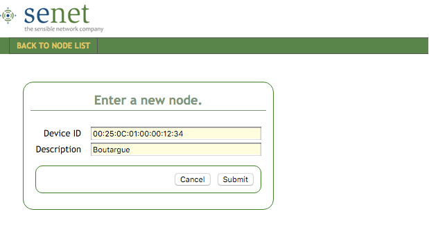

Charge the battery on the mote by connecting power `USB1` to power.  Next, operate the NorAm mote turning the `ON/OFF` switch to `ON`. When the mote is `ON` it (1) searches for a GPS signal to determine its location and (2) tries to send the signal to the nearest Senet gateway.  While there's no GPS signal, the mote transmits a null packet `010200000000000000001E` which translates to lat, long: `0, 0`, which is the [Gulf of Guinea](https://www.google.com/maps/place/0%C2%B000'00.0%22N+0%C2%B000'00.0%22E/@6.1567252,-4.3467511,4.41z/data=!4m2!3m1!1s0x0:0x0).  If you receive any null packets, **good news!**, you've got coverage.  If you receive a packet with data, even better, you can identify exactly where you have coverage.  

### Generate a map in the Senet portal
Once you've sent GPS data to Senet, navigate to the webpage with data for your device and follow the steps below to visualize the data in a map. Note that if you've only sent null packets (`010200000000000000001E`), there will not be anything to visualize. _(If you prefer, we've also detailed [how to do this manually](assets/map_Senet_PDUs.md))_. 

1. Click the gear to open the drop-down menu
2. Click `Device Edit`
3. Click `Implements Senet Protocol`
4. Click `Update`
5. Click `Transactions` to reveal drop-down menu
6. Select `GPS Data`
7. Scroll down to reveal the map
8. Double-click on the map to zoom in to view the relevant data

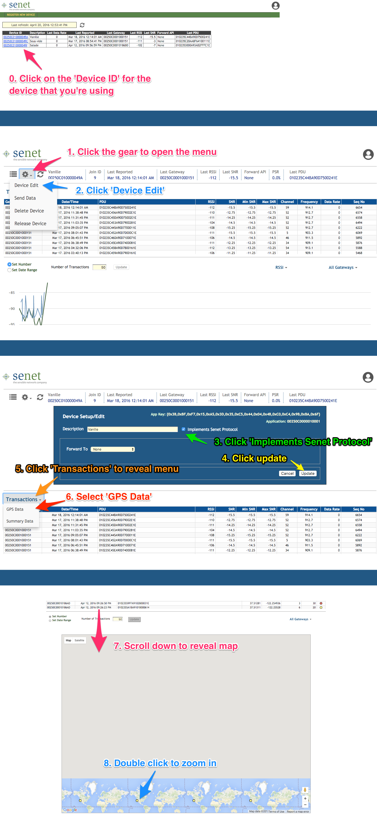  

   
## Configure the software

### mDot 
[  ](assets/mDot_9600_baud.bin?raw=true)  

By default, the Multitech mDot is configured to communicate with AT commands at a 115200 baud rate. However, we found that errors happened between the mDot and the Arduino when they tried to communitacte that fast, so [here's firmware](assets/mDot_9600_baud.bin?raw=true) (a .bin file) with a slower 9600 baud rate, which works much better.  

On a MacBook it's simple to load the firmware:   

* Drag & drop the .bin file into the mDot's disk image. After the firmware loads, you'll get an error message **`Disk Not Ejected Properly`** -- don't worry, that's normal. Now you'll want to validate that the firmware loaded correctly.  
* Unplug and replug the USB dev board from your laptop to be safe (keep the mDot attached to the dev board). 
* Open a terminal window (we use [iTerm2](https://www.iterm2.com/)). 
*  `cd /dev` to navigate to the folder with the dev board.
*  `ls` to list all of the contents of the folder. Look for a something that looks like *`tty.usbmodem1234`*. If you have more than one of these, you'll need to guess-and-check to determine which one is the dev board. 
*  _`screen tty.usbmodem1234 9600`_ to begin communicating with your board with the `screen` command. Again, you'll need to customize `tty.usbmodem1234` to have the numbers of your particular board.  The `9600` indicates that you're using a 9600 baud rate. 
*  A new screen will open, indicating that you're communicating with the board. Now type `"AT"` to confirm that the board uses AT commands.  
*  The board should respond with `OK`.  If it does, you're all set -- just eject the board and continue with the project.  If the board doesn't reply with `OK` then you'll need to retry installing the mDot firware.  
 
_(We haven't done this on a Windows PC. If Windows is different, please let us know how you loaded the mDot firmware and we'll update the instructions here.)_ 
 
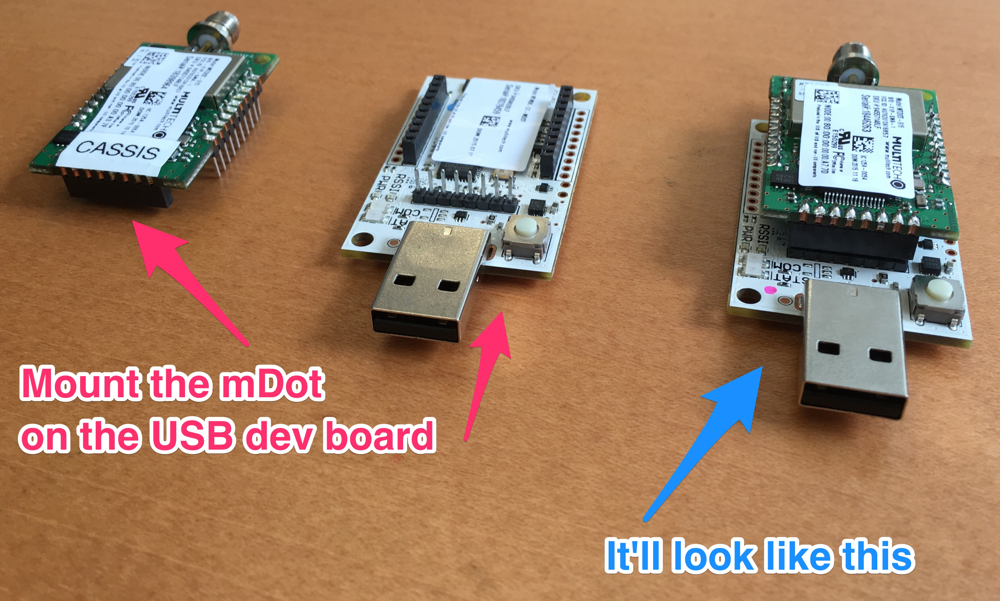  

  

  

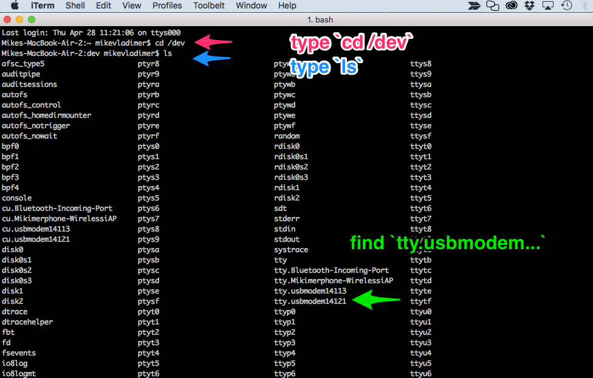  

  
### Register the mDot with Senet and get identifiers
You'll need to register the mDot with Senet to get identifiers for the Arduino sketch.  First, go to the [Senet portal](https://app.senetco.com/senetdev/main.aspx) and register your device by providing the device ID and nickname (similar to what you did with the NorAm mote). Next, click on the mDot name to open a webpage with the mDot's information and then follow these steps: 

1. Click on the gear to open the menu.
2. Click on `Device Edit` to reveal the `Device Setup/Edit` sub-menu.
3. Record `mDot_name`, the nickname you gave the mDot
4. Record `XXXX`, the last 4 digits of the ID number on the mDot
5. Record the Senet `App Key`, which is referred to as the `Network_key` in the Arduino sketch.
6. Record the Senet `Application` number, which is referred to as the `Network_ID` in the Arduino sketch. 

  
   


### Arduino sketch
[](assets/LoRa_Arduino_quickstart_April2016.ino?raw=true)  

**You must customize your Arduino code so that it works with your mDot**.  You'll need the [Arduino IDE](https://www.arduino.cc/en/Main/Software) to configure [the LoRa-Arduino sketch](assets/LoRa_Arduino_quickstart_April2016.ino?raw=true).  The code starting at Line 27 is a template for you to modify: 

```Arduino
// *** Select the current mDot **
// Update the mDot data below to reflect the name, network key, and network identifier your mDot(s) 
// You need to adjust the comments in the code to select the mDot you're currently using
/* AAA with ID ending in 11:22 */     const String mDot_name = "AAA"; const String Network_key =  "11:22:33:44:55:11:22:33:44:55:11:22:33:44:11:22"; const String Network_ID = "11:22:33:44:55"; 
/* BBB with ID ending in 33:44 */    // const String mDot_name = "BBB"; const String Network_key = "11:22:33:44:55:11:22:33:44:55:11:22:33:44:33:44"; const String Network_ID = "11:22:33:44:55"; 
/* CCC with ID ending in 55:66 */    // const String mDot_name = "CCC"; const String Network_key = "11:22:33:44:55:11:22:33:44:55:11:22:33:44:55:66"; const String Network_ID = "11:22:33:44:55"; 
```

Replace `AAA` with your mDot nickname, `11:22` with the last 4 digits of your mDot ID number, as well as the `Network_key` and `Network_ID` with your unique values from Senet.  Note that Senet provides the ID in the format `0x11,0x22,0x33,...` which you'll need to change to `11:22:33:...`.

This template assumes that you have three mDots (you're ambitious!) named `AAA`, `BBB` and `CCC` with ID numbers ending in `11:22`, `33:44` and `55:66`, respectively.  If you've only got one mDot, then simply delete the lines for `BBB` and `CCC`. If you've got multiple mDots, then you can update `BBB` and `CCC` with your mDot information. When you run the sketch, you'll need to ensure that the code is commented with `//` so that only one mDot is selected at a time.  Be sure to save your customized file. 

*show cassis and how we labeled the mDot and tied the device # to the name*

We've commented the .ino file extensively so that you can understand how the code works.  In brief, in `setup()` the device sends AT commands to join the LoRa network and in `loop()` the device samples the sensors every 100ms and sends a LoRa data payload every 15 minutes.  The sketch gathers sensor data to demonstrate *LoRa* by monitoring activities:  

 1. `Click` Count how many times users click a button.  
 2. `Sound` Count how many times there's a loud noise.   
 3. `Light` Meausre the average light level.  


## Assemble the hardware 

Assemble the hardware to match the diagram and photo below:

* To allow the mDot to mount properly, bend the two pins in the XB_TX row that are next to digital pins 11 and 12.    
* The Arduino transmit pin (Tx) needs to connect to the mDot's receive pin (Rx), and vice versa. To do this, place the jumpers on the XBee shield to connect mDot's receive Pin 2 (XB_RX) to Arduino pin 11. 
* Connect the mDot's transmit Pin 3 (XB_TX) to Arduino pin 10. In our Arduino sketch we configure Arduino pins 10 and 11 as Tx and Rx; if you change the pins defined in `SoftwareSerial` in the Arduino sketch, you'll need to change the hardware accordingly.  
* Mount the mDot on top of the XBee shield. Then mount the XBee shield on top of the Arduino Uno.  
* Use a wire to connect mDot reset pin 5 to Arduino analog pin A0.  
* Connect the Arduino 5V and GND to the power and ground rails (pins) on the sensors.   
* Connect the Arduino analog pins A1, A2 and A3 to the sound trigger, light sensor, and button, respectively. 

  
  
    
    
 **In case you chose the Adafruit sensors**   
 
   
 
 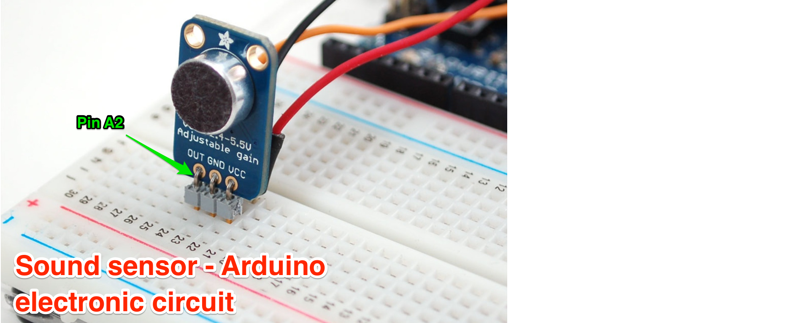   
 
   
 
 

## Test drive LoRa   

The hardware is assembled. You still have a few steps to go but you're getting close!

1. Open the Arduino code. 
2. If you haven't already, ensure that you customize the code with your unique `Network_ID` and `Network_key`.
3. Use the USB Type A-B cable to connect the Arduino to your computer.   
4. Upload the code from your IDE to the Arduino.   
   a. In the 'Tools' tab, select the 'Arduino/Genuino Uno' board, and the port corresponding to your USB cable _(/dev/cu.usbmodem1411 for Mac)_     
   b. Open the `Serial Monitor` window in the IDE.    
   c. Select 9600 baud as a baude rate     
   d. Click on the `upload` arrow    
   e. Wait until it is 'Done uploading.'     
5. You can monitor the Arduino in the Serial Monitor window -- things are good when you see `Successfully joined the LoRa network.     
    Arduino is beginning to read the sensors and send data...`   
6. Play with your three sensors and check if the data comes through on your Senet account.    
   _Notice that the `time_threshold` is set at 900. The data will be sent every 15 minutes unless you click the button 10 times in a row._   
   
You're sending data via LoRa, congratulations!   

### Connectivity debugging tips
If you're having trouble getting this project to work, here are some steps you can take:

* If your mDot keeps joining and then failing to join the network, you're at the edge of your coverage. Move to another spot (probably closer to outdoors) where you can get consistent coverage.   
* If your mDot isn't sending data to the Senet LoRa network, validate that you have coverage by plugging in the Semtech NorAm mote.  If you don't receive data from the mote, then you probably won't be able to receive data from the mDot either.  You'll need to find a new location (which could be as close as the nearest window or as far as miles away) where you get coverage.

   
    

   

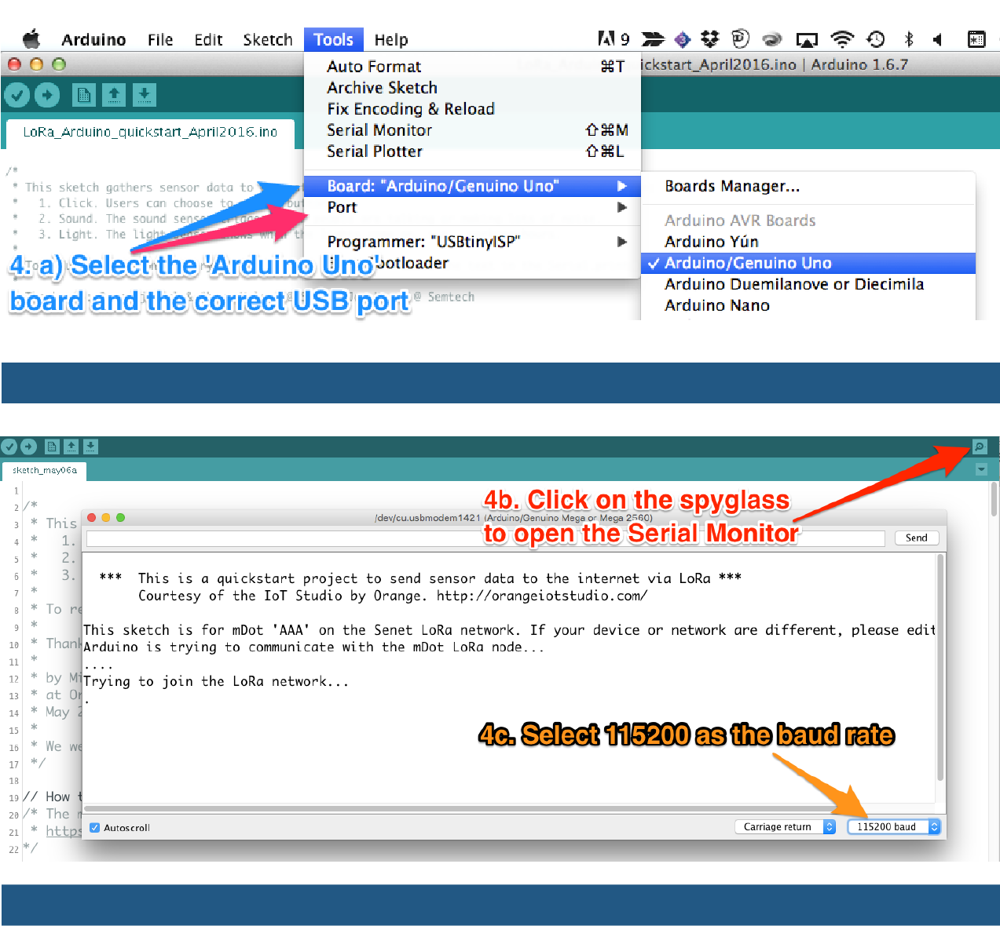   

   

   

  

### Send data from Senet via Zapier to a Google Spreadsheet
Once you're sending data to Senet, the final step is to get the data into a Google Sheet for easy analysis.  We'll now connect Senet, Zapier, and gDocs so that Senet sends a JSON payload to Zapier; then Zapier copies the payload into a column in a Google Sheet. In your browser, you'll need to keep tabs open to all three websites.


Create a new Google Sheet and name it something like `LoRa Arduino Awesome Sheet`. Copy these column headers and paste them into the Sheet:  
`Date/Time`, 	`PDU`, 	`Time PT`, 	`Mins past midnight`, 	`Click`, 	`Sound`, 	`Light`, 	`decoded PDU in ASCII`, 	`0`, 	`2`   

_These column headers are formatted so that you can easily copy-paste them into gDocs without manipulation._ 

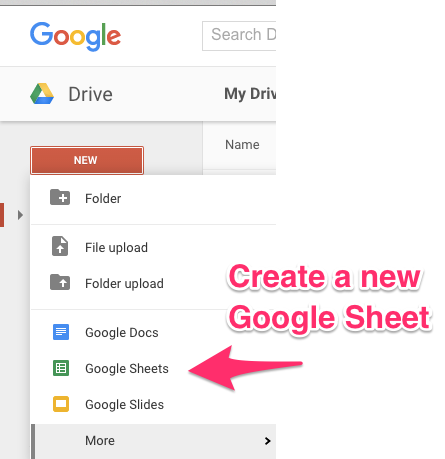  

  

  

Now that your gDoc Sheet is ready, you can prepare your zap. We start with the `Trigger`.

1. In Zapier, click `Make a Zap`. 
2. In the trigger search bar, type `webhook` and select `Webhooks by Zapier`. 
3. Select `Catch Hook`.
4. In `Pick off a child key (optional)` just click `Continue` to skip this step.
5. Click `Copy to clipboard` to copy the the Zapier webhook URL.

  

  

  

  

  

You've created the Zapier webhook that will receive the JSON payload from Senet.  Switch from the Zapier tab to the Senet tab -- continue to keep both tabs open. In the Senet portal:

1. Navigate to the `Device Setup/Edit` window for your mDot.
2. Open the `Forward To` drop-down menu and select `HTTPS Post`.
3. Paste the webhook URL from Zapier.
4. Click `Update`.

Senet will now send a copy of the mDot's payload to Zapier, including the PDU. **Make sure that your Arduino is sending data so that Senet delivers data to Zapier.**  Switch from the Senet tab back to the Zapier tab. 

  

  

In Zapier, click `Ok, I did this` and Zapier will look for JSON payloads from Senet.  Now we'll configure the zap's `Action` in Google Sheets:  

1. Select `Google Sheets` as your Action App.
2. Click `Create a Row`, then `Save + Continue`.
3. Grant permission for Zapier to interact with your Google Sheets account, then `Save + Continue`. 
4. Connect the Google Sheet columns to the parts of the JSON payload coming into the webhook:
  a. Select your `Sheet`.
  b. Select your `Worksheet`.
  c. Connect the Google Sheet column `datetime` to the in-coming webhook payload `Txtime`.
  d. Connect the Google Sheet column `pdu` to the in-coming webhook payload `Pdu`.
  e. Click `Continue`. 
5. Click `Create & Continue`. 
6. Click `Finish`.  
7. Finally, turn your zap `ON`! 

  

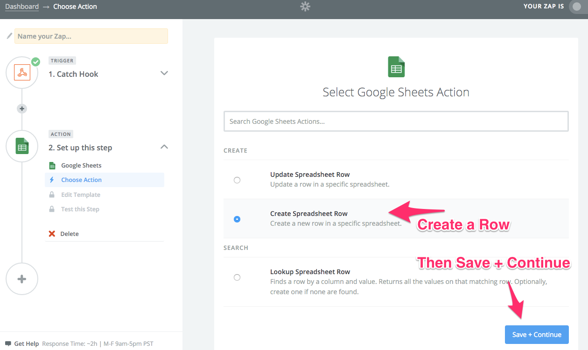  

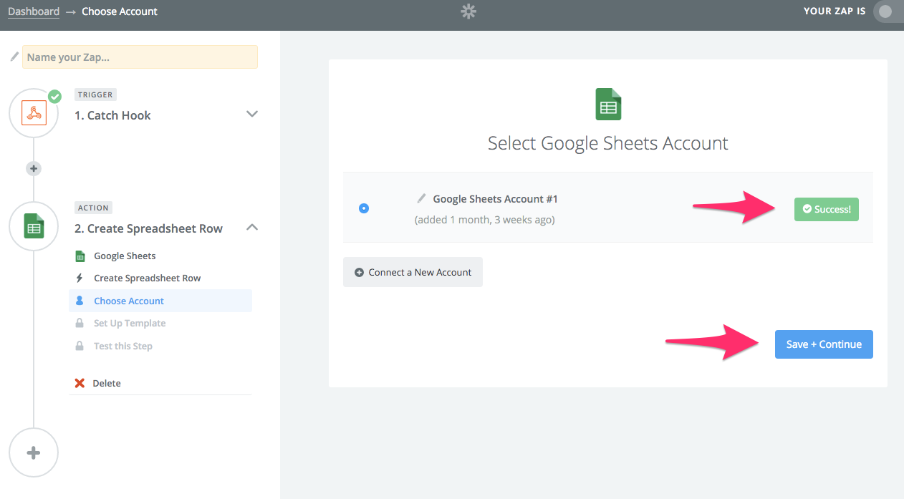  

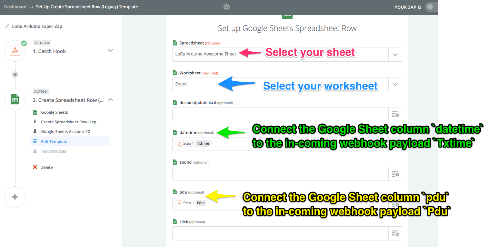  

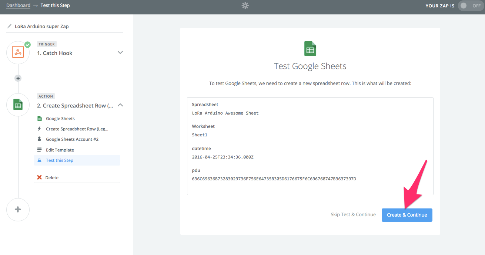  

  

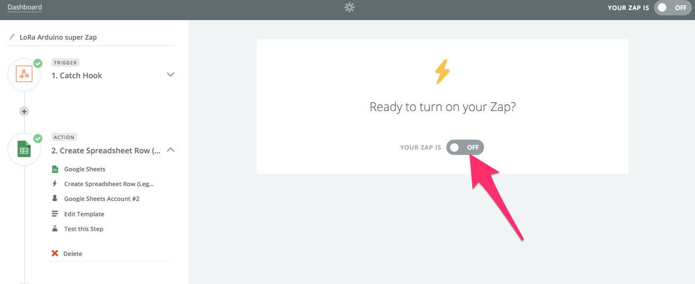  

Switch from the Zapier tab to the Google Sheet tab to see the results of the integration. Zapier is now automatically posting data into Column A, `Date/Time` and Column B, `PDU`.  We'll now add formulas to **Row 3** of the Sheet to decode the PDU:   

Column C - **Time PT**    
`=CONCATENATE( mod(left(right($A3,8),2)+17,24),":", right(left(right($A3,8),5),2))`
*The `17` in this formula corresponds to Pacific Time (PT) in San Francisco. You can adjust this value for your timezone -- for instance, `20` corresponds to Eastern Time (ET) in New York City.*

Column D - **Mins past midnight**   
`=60*mod(left(right($A3,8),2)+17,24)+ right(left(right($A3,8),5),2)`
_We use this metric to more easily visualize data when we graph it._  

Column E - **Click**   
`=REGEXEXTRACT(H3,"\(([0-9]+)\)")`
_This is a count of how many times users clicked the button._

Column F - **Sound**   
`=REGEXEXTRACT(H3,"\[([0-9]+)\]")`
_This is a count of how many loud noises (impulses) happened._

Column G - **Light**   
`=REGEXEXTRACT(H3,"\{([0-9]+)\}")/10`
_This is the average light level. The Arduino measures this for just 1 second every 15 minutes._

Column H - **decoded PDU in ASCII**   
`=CONCATENATE(I3:BA3)`

Column I - **decoded first PDU byte**  
`=if(I$1<len($B3), char(hex2dec(left(REPLACE($B3,1,I$1,""),2))), " ")`  
*This formula converts the first PDU byte to ASCII text.*

Column J - **decoded second PDU byte** 
`=if(J$1<len($B3), char(hex2dec(left(REPLACE($B3,1,J$1,""),2))), " ")`  

Columns K to AN  - **decoded PDU bytes**    
Each column analyzes one byte of the PDU string. We're using the [ASCII table](http://www.asciitable.com/) in order to translate the PDU (numerical representation) into characters (readable data).  These formulas rely on numbers in **Row 1** incrementing by 2: 0, 2, 4, 6...  

* In cell `J1`, change the value `2`  to be the formula `=i1+2`.  
* Copy-paste that formula out from cell `J1` to `AN1`.
* Now in **Row 3** copy-paste the formula from cell `J3` to `AN3`. 
   
   
  


**Let us know how it went via [@OrangeIoTstudio](https://twitter.com/orangeiotstudio)!**


## Build on LoRa, Promote your vision
We hope that this project will be a foundation that you can build off of -- if you're trying to do that [here are resources](assets/build_off_quickstart.md) to help you.

Share your experience -- we're featuring the most interesting projects on our website.


## Acknolwedgements

[Mike Vladimer](https://twitter.com/mikevladimer) & [Anna Aflalo](https://twitter.com/anna_aflalo) developed this project at the [Orange IoT Studio](http://orangeiotstudio.com), part of [Orange Silicon Valley](http://www.orangesv.com/). We welcome feedback -- you can contact us via twitter: [@orangeiotstudio](https://twitter.com/orangeiotstudio), 
 [@mikevladimer](https://twitter.com/mikevladimer) & [@anna_aflalo](https://twitter.com/anna_aflalo).  
**Thanks to** Dave Kjendal & Shaun Nelson @ Senet, Joe Knapp @ Semtech. 
 
April 2016 

