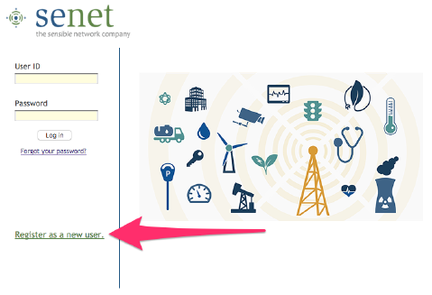
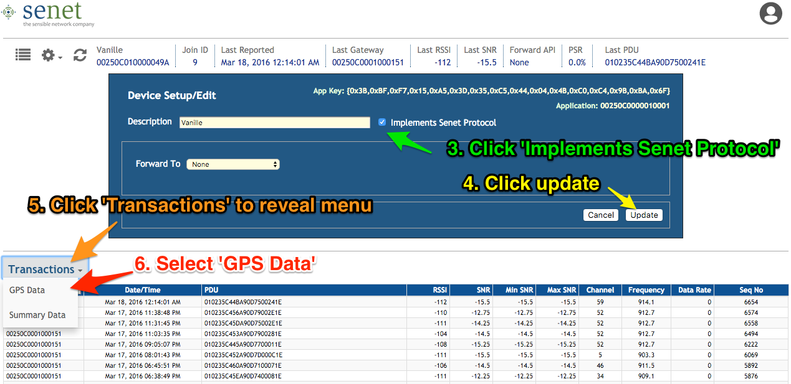
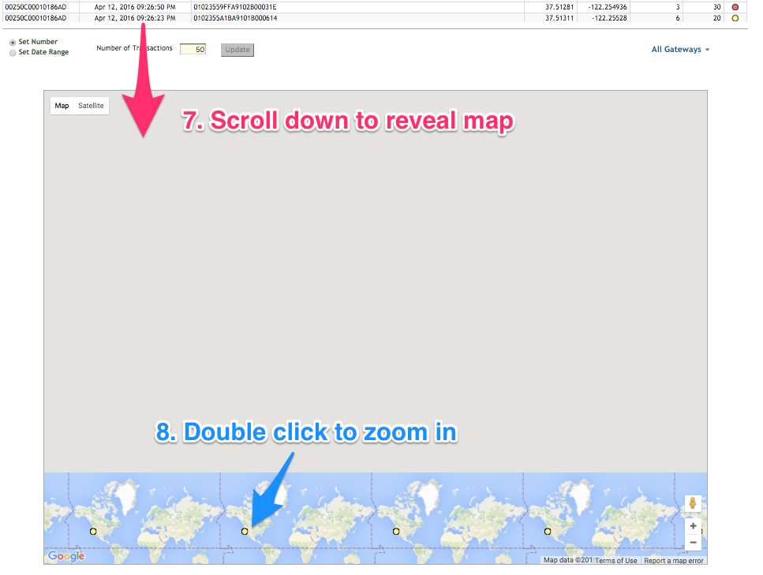
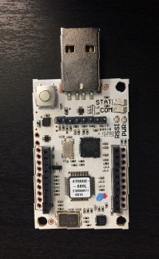
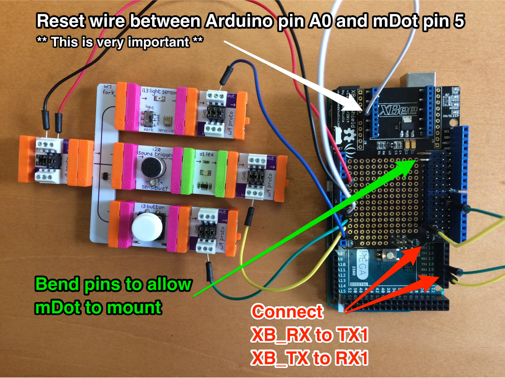

# LoRa-Arduino quickstart project


# Overview
###This project allows you to quickly try LoRa communications. 
**LoRa** is an exciting new technology for communicating at **Lo**ng **Ra**nge, low power, and low cost.  This project uses an Arduino Uno and a [Multitech mDot LoRa node](http://www.multitech.com/models/94557148LF) to send data to the [Senet LoRa network](https://app.senetco.com/senetdev/login.aspx).  Senet provides the gateways to receive the LoRa signal; [Zapier](https://zapier.com) and  Google Spreadsheets provide the rest of the software. 

It should take **about 1 hour to complete this project**, once you have the hardware.

This project was developed by the [Orange IoT Studio](http://orangeiotstudio.com/) to promote the consideration and adoption of LoRa. To that end, the IoT Studio is [supporting companies](http://orangeiotstudio.com/) interested in LoRa by giving out hardware kits and by funding co-development.  


### LoRa is great for IoT
LoRa is an ideal communications technology for many internet-of-things (IoT) devices because **internet connectivity** is a key feature of IoT while also one of IoT devices' the biggest burdens.  Specifically, pairing devices with WiFi or Bluetooth is tedious; cellular connectivity is easy to implement and can transmit megabytes (MB) of data, but it's often not affordable for simple IoT devices. That's where LoRa comes in. For simple IoT devices that only need to send kilobytes (KB) of data or less, LoRa is an ideal solution.  

Public LoRa networks are being deployed world wide, including by [Orange in France](http://www.orange.com/en/Press-and-medias/press-releases-2016/press-releases-2015/Orange-deploys-a-network-for-the-Internet-of-Things). This project uses the [Senet LoRa network](https://app.senetco.com/senetdev/login.aspx) in North America since it was developed by the [Orange IoT Studio](http://orangeiotstudio.com/), part of [Orange Silicon Valley](http://orangesv.com/) in San Francisco. 

### Project overview  
1. Get the hardware 
2. Create your accounts
3. Verify LoRa coverage
4. Configure the software
5. Assemble the hardware 
6. Test drive LoRa
7. Build on LoRa & promote your vision

### Skills you need

* Basic programming experience
* Familiarity with Arduino
 
### _Disclaimer_
_LoRa is a new technology and this project is in alpha, so it could break. If you're cool trying new things that aren't 100% reliable, proceed and have fun._   


## Get the hardware
You'll need to either purchase the equipment yourself or apply for a hardware kit from the IoT studio. 

### Apply for support from the IoT Studio
The IoT Studio is [supporting the developer community](http://orangeiotstudio.com/) to encourage use of LoRa.  You can apply for a free hardware kit containing the bill of materials, below. If you work for a company with a compelling use case, you can also apply for funded co-development.  The IoT Studio will be showcasing prototypes that demonstrate compelling LoRa use cases.


### Bill of Materials (BOM)
You need the basic equipment for the project and a set of sensors, either by LittleBits or by Sparkfun.  You'll need one (1) of each item below, unless otherwise noted. The prices are estimates.  _Note that the XBee shield is only used as a physical interface between the mDot and the Arduino. This project does not use XBee communications._


####Basic equipment  

* [Multitech mDot](http://www.digikey.com/product-search/en?mpart=MTDOT-915-X1P-SMA-1&v=591&v=881),  $60 
* [Arduino Uno](https://www.sparkfun.com/products/11021),  $25 
* [XBee shield](http://www.robotmesh.com/xbee-shield-v2-0),  $10   
* [Antenna for mDot](http://www.digikey.com/product-detail/en/multi-tech-systems/AN868-915A-10HRA/881-1242-ND/5246371), $10
* [USB A-B cable](https://www.adafruit.com/products/62), $4
* [mDOT USB developer board](http://www.multitech.com/brands/micro-mdot-devkit), _??get link with price!_
* [Wires](https://www.adafruit.com/products/1956), $2 (you'll need 6 male-male wires)
* [Semtech NorAm mote LoRa network tester](http://www.semtech.com/images/datasheet/NorAmMote_User_Guide_3v0.2.pdf), _??get link with price!_	

####LittleBits sensors 
LittleBits sensors are easier to use, but more expensive.  If you prefer the something more affordable use the Adafruit sensors.

* [LittleBits Proto](https://littlebits.cc/bits/proto), $50 (you'll need 4 Protos at $12/piece)
* [LittleBits Fork](https://littlebits.cc/bits/fork), $12
* [LittleBits Sound trigger](http://littlebits.cc/bits/sound-trigger), $12
* [LittleBits Light sensor](http://littlebits.cc/bits/light-sensor), $12
* [LittleBits Button](http://littlebits.cc/bits/button), $8
* [LittleBits LED](http://littlebits.cc/bits/led), $8
 

#### Adafruit sensors 
Adafruit sensors require more work, but are more affordable. If you prefer something easier, use the LittleBits sensors.  
_Mike & Anna need to try this!!_

* [Breadboard](https://www.adafruit.com/products/64), $5
* [Sound trigger](??), _??get link with price!_ 
* [Light sensor - Photo transistor](https://www.adafruit.com/products/2831), $0.95
* [Tactile Button switch ](https://www.adafruit.com/products/367), $2.5
* [LED](https://www.adafruit.com/products/299), $4

## Create your accounts
You'll need to create accounts with the following websites to get this project to work.  

### Senet
[Senet](https://app.senetco.com/senetdev/login.aspx) is continuing to expand their public LoRa network in the United States. You'll need to create an account with Senet to view and access your data.  

[  ](https://app.senetco.com/senetdev/login.aspx)  

### Zapier
[Zapier](https://zapier.com) automates the flow of data between Senet and Google Docs. For this project, we'll have Senet do an HTTP Post to a Zapier webhook. Zapier then puts the contents of Senet's JSON payload into a row in a Google Spreadsheet (gDocs). 

[  ](https://zapier.com/)

### Google Drive
You'll use [Google Spreadsheets](https://docs.google.com/spreadsheets/u/0/) to view and analyze your data in this project. Since you probably already have a Google Drive account, we highly recommend that you do all work on this project in new spreadsheets, as opposed to tabs in existing spreadsheets.  This safety measure will help ensure that if things go wrong, they don't affect your other projects. 

## Verify LoRa coverage 
[Senet](https://app.senetco.com/senetdev/login.aspx) provides a public LoRa network in North America and you'll need to verify where you have coverage. Specifically, there's a chance that you might not have coverage at your workbench, but that there's LoRa coverage in another part of your building or nearby. You can use [Semtech's NorAm LoRa Mote](http://www.semtech.com/images/datasheet/NorAmMote_User_Guide_3v0.2.pdf) to determine where you have coverage.  
  
In this quickstart project, the North American (NorAm) mote receives a GPS signal and sends its location to Senet as a hexadecimal data payload.  We convert that string into latitude and longitude (lat-long) data to view the exact location on a map. Senet refers to the data payload as a "packet data unit" (PDU). 

### Example
>Hexadecimal PDU payload from the NorAm mote: `010235C107A8F6CCFFFA14`  
>The latitude is hex encoded as: `35C107`  
>The longitude is hex encoded as: `A8F6CC`  
>This converts to decimal lat, long: `37.79579494`, `-122.3943043` which is the [Ferry Building in San Francisco](https://www.google.com/maps/place/Ferry+Building/@37.7940467,-122.3962511,17z/data=!4m2!3m1!1s0x0000000000000000:0x6cf7a313d6a53ec7).     
  	   	 


### Send GPS data to Senet
Once you have the Semtech NorAm mote and a Senet account, you'll need to register the device with Senet so they know to send you its data.  After you're logged into your Senet account, click on `REGISTER NEW DEVICE`. Next input the hexadecimal device ID (e.g., `00:25:0C:01:00:00:12:34`) and create a nickname for the device (e.g., `Boutargue`).  If you're using a NorAm mote from the IoT Studio, then it will come pre-loaded with the device ID and firmware to operate on the Senet network. If you purchased a NorAm mote, then you will need to [contact Senet](http://www.senetco.com/) to get firmware and a device ID.


The NorAm mote contains a battery so begin by charging it using a micro-USB cable in the `USB1` port.  The `CHG` light is red while the mote is charging and green when fully charged. The `USR` light blinks green while the mote is searching for GPS and is solid green when it has locked the GPS signal.  You don't need to worry about lights `1` `2` and `3` nor the `USB2` port (which is covered with orange tape) -- it's a port for updating the mote's firmware. 

Next, operate the NorAm mote turning the `ON/OFF` switch to `ON`. When the mote is `ON` it (1) searches for a GPS signal to determine its location and (2) tries to send the signal to the nearest Senet gateway.  While there's no GPS signal, the mote transmits a null packet `010200000000000000001E` which translates to lat, long: `0, 0`, which is the [Gulf of Guinea](https://www.google.com/maps/place/0%C2%B000'00.0%22N+0%C2%B000'00.0%22E/@6.1567252,-4.3467511,4.41z/data=!4m2!3m1!1s0x0:0x0).  If you receive any null packets, **good news!**, you've got coverage.  If you receive a packet with data, even better, you can identify exactly where you have coverage.  

### Generate a map in the Senet portal
Once you've sent GPS data to Senet, navigate to the webpage with data for your device and follow the steps below to visualize the data in a map. _(If you prefer, we've also detailed [how to do this manually](assets/map_Senet_PDUs.md))_. 

1. Click the gear to open the drop-down menu
2. Click `Device Edit`
3. Click `Implements Senet Protocol`
4. Click `Update`
5. Click `Transactions` to reveal drop-down menu
6. Select `GPS Data`
7. Scroll down to reveal the map
8. Double-click on the map to zoom in to view the relevant data

  
   
  
   
  
   
  

   
## Configure the software

### mDot 
[  ](assets/mDot_9600_baud.bin?raw=true)  

By default, the Multitech mDot is configured to communicate with AT commands at a 115200 baud rate. However, we found that errors happened between the mDot and the Arduino when they tried to communitacte that fast, so [here's firmware](assets/mDot_9600_baud.bin?raw=true) with a slower 9600 baud rate, which works much better.  

Mount the mDot on the mDot USB developer board and then plug it into the USB port on your computer.  On a MacBook it's simple to load the firmware: you drag & drop the .bin file into the mDot's disk image. _(We haven't done this on a Windows PC. If Windows is different, please let us know how you loaded the mDot firmware and we'll update the instructions here.)_ 
 
  
  
### Register the mDot with Senet and get identifiers
You'll need to register the mDot with Senet to get identifiers for the Arduino sketch.  First, go to the [Senet portal](https://app.senetco.com/senetdev/main.aspx) and register your device by providing the device ID and nicknamen (similar to what you did with the NorAm mote). Next, click on the mDot name to open a webpage with the mDot's information and then follow these steps: 

1. Click on the gear to open the menu.
2. Click on `Device Edit` to reveal the `Device Setup/Edit` sub-menu.
3. Record `mDot_name`, the nickname you gave the mDot
4. Record `XXXX`, the last 4 digits of the ID number on the mDot
5. Record the Senet `App Key`, which is referred to as the `Network_key` in the Arduino sketch.
6. Record the Senet `Application` number, which is referred to as the `Network_ID` in the Arduino sketch. 

  
   


### Arduino sketch
[](assets/LoRa_Arduino_quickstart_April2016.ino?raw=true)  

**You must customize your Arduino code so that it works with your mDot**.  You'll need the [Arduino IDE](https://www.arduino.cc/en/Main/Software) to configure [the LoRa-Arduino sketch](assets/LoRa_Arduino_quickstart_April2016.ino?raw=true).  The code starting at Line 27 is a template for you to modify: 

```Arduino
// *** Select the current mDot **
// Update the mDot data below to reflect the name, network key, and network identifier your mDot(s) 
// You need to adjust the comments in the code to select the mDot you're currently using
/* AAA with ID ending in 11:22 */     const String mDot_name = "AAA"; const String Network_key =  "11:22:33:44:55:11:22:33:44:55:11:22:33:44:11:22"; const String Network_ID = "11:22:33:44:55"; 
/* BBB with ID ending in 33:44 */    // const String mDot_name = "BBB"; const String Network_key = "11:22:33:44:55:11:22:33:44:55:11:22:33:44:33:44"; const String Network_ID = "11:22:33:44:55"; 
/* CCC with ID ending in 55:66 */    // const String mDot_name = "CCC"; const String Network_key = "11:22:33:44:55:11:22:33:44:55:11:22:33:44:55:66"; const String Network_ID = "11:22:33:44:55"; 
```

Replace `AAA` with your mDot nickname, `11:22` with the last 4 digits of your mDot ID number, as well as the `Network_key` and `Network_ID` with your unique values from Senet.  Note that Senet provides the ID in the format `0x11,0x22,0x33,...` which you'll need to change to `11:22:33:...`.

This template assumes that you have three mDots (you're ambitious!) named `AAA`, `BBB` and `CCC` with ID numbers ending in `11:22`, `33:44` and `55:66`, respectively.  If you've only got one mDot, then simply delete the lines for `BBB` and `CCC`. If you've got multiple mDots, then you can update `BBB` and `CCC` with your mDot information. When you run the sketch, you'll need to ensure that the code is commented with `//` so that only one mDot is selected at a time.

*show cassis and how we labeled the mDot and tied the device # to the name*

We've commented the .ino file extensively so that you can understand how the code works.  In brief, in `setup()` the device sends AT commands to join the LoRa network and in `loop()` the device samples the sensors every 100ms and sends a LoRa data payload every 15 minutes.  The sketch gathers sensor data to demonstrate *LoRa* by monitoring activities:  

 1. `Click` Count how many times users click a button.  
 2. `Sound` Count how many times there's a loud noise.   
 3. `Light` Meausre the average light level. 

## Assemble the hardware 

Assemble the hardware to match the diagram and photo below:

* To allow the mDot to mount properly, bend the two pins in the XB_TX row that are next to digital pins 11 and 12.    
* The Arduino transmit pin (Tx) needs to connect to the mDot's receive pin (Rx), and vice versa. To do this, place the jumpers on the XBee shield to connect mDot's receive Pin 2 (XB_RX) to Arduino pin 11; also connect mDot's transmit Pin 3 (XB_TX) to Arduino pin 10. In our Arduino sketch we configure Arduino pins 10 and 11 as Tx and Rx.  
* Mount the mDot on top of the XBee shield on top of the Arduino Uno.  
* Use a wire to connect mDot reset pin 5 to Arduino analog pin A0.  
* Connect the Arduino 5V and GND to the power and ground rails for the sensors.  
* Connect the Arduino analog pins A1, A2 and a3 to the sound trigger, light sensor, and button. 

  
  
  
  
  
  
  
  
  
  
  

## Test drive LoRa
Power up and run it!
Let us know that it worked

## Build on LoRa, Promote your vision
We hope that you'll use this project 
Share your experience -- we're featuring the most interesting projects on our website.

## Acknolwedgements

Mike Vladimer & Anna Aflalo developed this project at the [Orange IoT Studio](http://orangeiotstudio.com), part of [Orange Silicon Valley](http://www.orangesv.com/). We welcome feedback -- you can contact us via twitter: [@orangeiotstudio](https://twitter.com/orangeiotstudio), 
 [@mikevladimer](https://twitter.com/mikevladimer) & [@anna_aflalo](https://twitter.com/anna_aflalo).  
**Thanks to** Dave Kjendal & Shaun Nelson @ Senet, Joe Knapp @ Semtech. 
 
April 2016 

