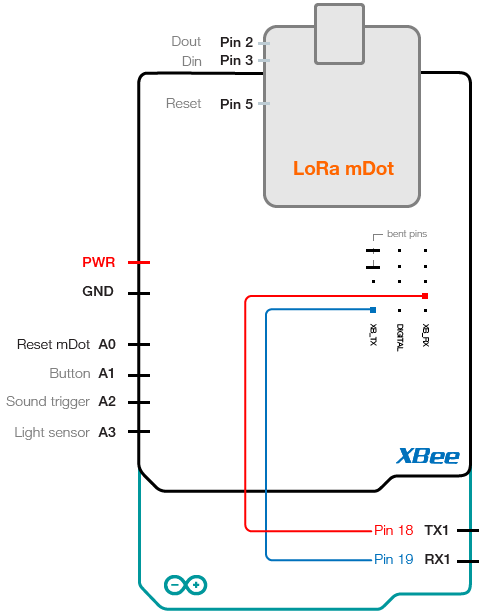
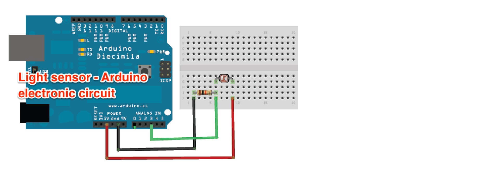

# 5. Assemble the hardware 

Assemble the hardware to match the diagram and photo below:

* To allow the mDot to mount properly, bend the two pins in the XB_TX row that are next to digital pins 11 and 12.    
* Use a male-female wire to connect Arduino pin 18 (TX1) to any pin on the XBee shield in the XB_RX row. This will connect the Arduino transmit pin (TX1) to the mDot's receive pin (RX) via the XBee shield. 
* Use a male-female wire to connect Arduino pin 19 (RX1) to any pin on the XBee shield in the XB_TX row. This will connect the Arduino receive pin (RX1) to the mDot's transmit pin (TX) via the XBee shield. 
 * Mount the mDot on top of the XBee shield. Then mount the XBee shield on top of the Arduino Mega.  
* Use a wire to connect mDot reset pin 5 to Arduino analog pin A0.  
* Connect the Arduino 5V and GND to the power and ground rails (pins) on the sensors.   
* Connect the Arduino analog pins A1, A2 and A3 to the sound trigger, light sensor, and button, respectively. 

  
  
    
    
##In case you're using Adafruit sensors  
 
   
 
    
 
   
 
 

You can test your basic wiring ( Arduino Mega and sensors only - mDot not mounted yet ) with this [Arduino code](adafruit_wiring_test.ino).  

### Next tutorial
6.[Test drive LoRa](6_TestLoRa.md) 
