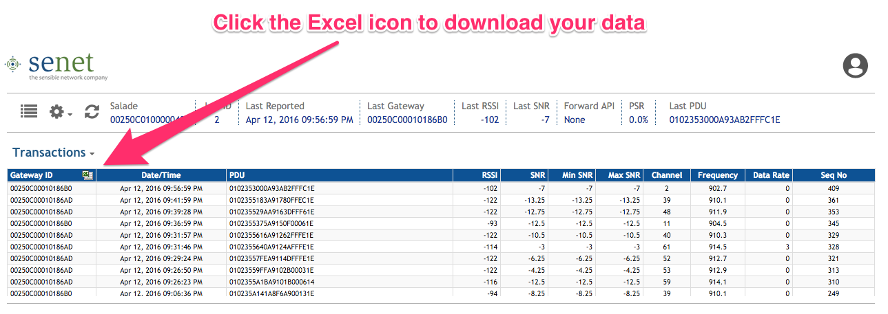
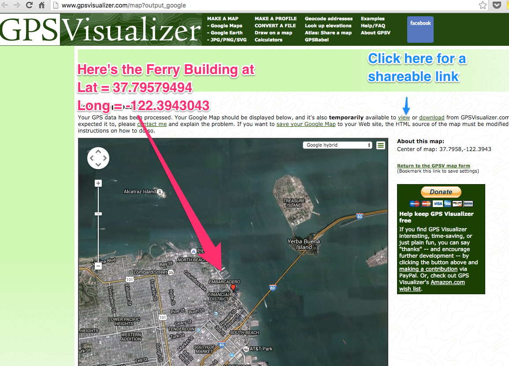

# Convert a Senet PDU to a Google Map

### The easiest way to generate a map is within the Senet portal. 
### Below is a manual method for creating a map.

[Senet](https://app.senetco.com/senetdev/login.aspx) provides a public LoRa network in North America and you'll need to verify where you have coverage. Specifically, there's a chance that you might not have coverage at your workbench, but that there's LoRa coverage in another part of your building or nearby. You can use [Semtech's NorAm LoRa Mote](http://www.semtech.com/images/datasheet/NorAmMote_User_Guide_3v0.2.pdf) to determine where you have coverage.  
  
In this quickstart project, the North American (NorAm) mote receives a GPS signal and sends its location to Senet as a hexadecimal data payload.  We convert that string into latitude and longitude (lat-long) data to view the exact location on a map. Senet refers to the data payload as a "packet data unit" (PDU). 

### Example
>Hexadecimal PDU payload from the NorAm mote: `010235C107A8F6CCFFFA14`  
>The latitude is hex encoded as: `35C107`  
>The longitude is hex encoded as: `A8F6CC`  
>This converts to decimal lat, long: `37.79579494`, `-122.3943043` which is the [Ferry Building in San Francisco](https://www.google.com/maps/place/Ferry+Building/@37.7940467,-122.3962511,17z/data=!4m2!3m1!1s0x0000000000000000:0x6cf7a313d6a53ec7).     
  	   	 

### Send GPS data to Senet
Once you have the Semtech NorAm mote and a Senet account, you'll need to register the device with Senet so they know to send you its data.  After you're logged into your Senet account, click on `REGISTER NEW DEVICE`. Next input the hexadecimal device ID (e.g., `00:25:0C:01:00:00:12:34`) and create a nickname for the device (e.g., `Boutargue`).  If you're using a NorAm mote from the IoT Studio, then it will come pre-loaded with the device ID and firmware to operate on the Senet network. If you purchased a NorAm mote, then you will need to [contact Senet](http://www.senetco.com/) to get firmware and a device ID.

The NorAm mote contains a battery so begin by charging it using a micro-USB cable in the `USB1` port.  The `CHG` light is red while the mote is charging and green when fully charged. The `USR` light blinks green while the mote is searching for GPS and is solid green when it has locked the GPS signal.  You don't need to worry about lights `1` `2` and `3` nor the `USB2` port which a port for updating the mote's firmware. 

Next, operate the NorAm mote turning the `ON/OFF` switch to `ON`. When the mote is `ON` it (1) searches for a GPS signal to determine its location and (2) tries to send the signal to the nearest Senet gateway.  While there's no GPS signal, the mote transmits a null packet `010200000000000000001E` which translates to lat, long: `0, 0`, which is the [Gulf of Guinea](https://www.google.com/maps/place/0%C2%B000'00.0%22N+0%C2%B000'00.0%22E/@6.1567252,-4.3467511,4.41z/data=!4m2!3m1!1s0x0:0x0).  If you receive any null packets, **good news!**, you've got coverage.  If you receive a packet with data, even better, you can identify exactly where you have coverage.  

### Extract lat-long data

In the Senet portal, select your mote and click the Excel icon to download your data as a .csv file.  

The important part of the .csv file is **Column C**, which contains the **P**acket **D**ata **U**nit (for simplicity, this example ignores other columns of data).  Your .csv file should look like this:

| `Column A` | `Column B` | `Column C` | `Column D` |
|:---:|:---:|:---:|:---:|
| **Gateway EUI** | **UTC** | **PDU** | **...** |
|00250C00010186B0 | 4/13/16 2:56 | 010235C107A8F6CCFFFA14 | ... |

Use these formulas in Microsoft Excel or Google Spreadsheets to convert the hexadecimal payload to usable lat-long data: 

**Latitude**  `=(HEX2DEC(MID($C2,5,6))*90)/8388607`  
**Longitude**  `=(HEX2DEC(MID($C2,11,6))*180)/8388608-360`  
**Elevation** `=HEX2DEC(MID($C2,17,4))`  
**Transmit Power** (TxPow) `=HEX2DEC(MID($C2,21,2))`  

The file with formulas should look like this:

| `Column C` | `Column D` | `Column E` | `Column F`  |
|:---:|:---:|:---:|:---:|
| **PDU** | **Lat** | **Long** | **...** |
| 010235C107A8F6CCFFFA14 | 37.79579494 | -122.3943043 | ... |

Last, you'll take the lat-long data and plot it on a Google map so that it's easy to interpret.  First, copy-paste the lat-long data into its own spreadsheet.  The latitude data should be in Column A and longitude data in Column B.  Next, navigate to [GPS Visualizer for Google Maps](http://www.gpsvisualizer.com/map_input?form=google) and configure settings: 

1. Set "Line width" to 0
2. Set tracks to "named with time stamps"
3. Set labels as "permanent"
4. Select the file with your lat-long data
5. Click **`Draw the map`**
6. You can click on the `view` link to get a shareable link to your map. 

The file with just lat-long data should look like: 

| `Column A` | `Column B` |
|:---:|:---:| 
| Lat | Long |  
| 37.79579494 | -122.3943043 | 
| ... | ... |

   
